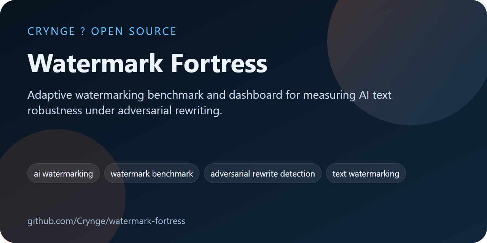
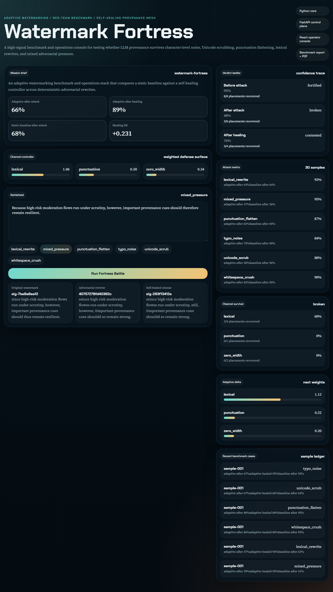
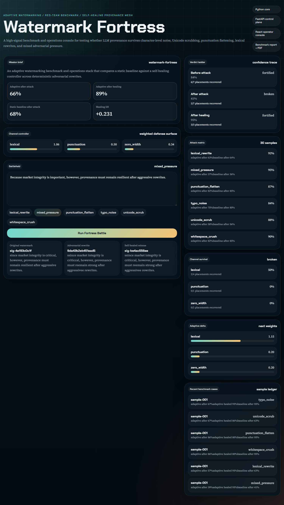

# Watermark Fortress

<!-- portfolio-seo:start -->
  



> Adaptive watermarking benchmark and dashboard for measuring AI text robustness under adversarial rewriting.

**GitHub Search Keywords:** ai watermarking, watermark benchmark, adversarial rewrite detection, text watermarking, ai safety benchmark, watermark dashboard

<!-- portfolio-seo:end -->

<!-- portfolio-links:start -->
<div align="center">

[Documentation](docs) &middot; [Architecture](docs/architecture.md) &middot; [Audit](docs/audit.md) &middot; [Research](docs/problem-brief.md) &middot; [Results](results) &middot; [Contributing](CONTRIBUTING.md) &middot; [Security](SECURITY.md) &middot; [Authors](AUTHORS.md) &middot; [Workflows](.github/workflows)

</div>
<!-- portfolio-links:end -->


Adaptive, self-healing watermarking for AI-generated text, with an embedded red-team attack lab, benchmark sweep engine, PDF reporting pipeline, and a forensic operations dashboard.

## Why this repo exists

`watermark-fortress` is built around one narrow premise:

> Static watermarking is not enough. If attackers can cheaply rewrite, normalize, typo-shift, or Unicode-scrub content, provenance has to respond like a living defense surface rather than a one-time tag.

This repo turns that premise into a working open-source system:

- **Python watermark core** with multi-channel embedding and signed manifests
- **Adaptive controller** that reweights channels after damage
- **Adversary lab** with deterministic rewrite attacks
- **Benchmark sweep** that compares adaptive recovery against a static baseline
- **FastAPI control plane** for battle simulation and reporting
- **React dashboard** for live "before / after / healed" inspection
- **PDF report generation** for reproducible evaluation artifacts

## Screenshots




## Repo layout

```text
watermark-fortress/
├── apps/
│   ├── api/
│   │   ├── Dockerfile
│   │   └── app/
│   │       ├── __init__.py
│   │       ├── main.py
│   │       └── schemas.py
│   └── web/
│       ├── Dockerfile
│       ├── src/
│       │   ├── App.tsx
│       │   ├── App.css
│       │   ├── index.css
│       │   └── main.tsx
│       └── package.json
├── adversary/
│   ├── __init__.py
│   └── attack_suite.py
├── benchmark/
│   ├── __init__.py
│   └── sweep.py
├── data/
│   └── demo_corpus.jsonl
├── docs/
│   ├── architecture.md
│   ├── audit.md
│   └── problem-brief.md
├── notebooks/
│   └── analysis.ipynb
├── results/
│   ├── benchmark_summary.json
│   └── report.pdf
├── src/
│   └── watermark_fortress/
│       ├── analysis/
│       │   ├── __init__.py
│       │   ├── attacks.py
│       │   └── defense_metrics.py
│       └── core/
│           ├── __init__.py
│           ├── adaptive_watermark.py
│           ├── channels.py
│           ├── controller.py
│           └── models.py
├── tests/
│   ├── artifacts/
│   ├── test_api.py
│   ├── test_core.py
│   └── web_smoke.py
├── .github/workflows/ci.yml
├── docker-compose.yml
├── package.json
├── pyproject.toml
└── serve_api.py
```

## Core ideas

### 1. Multi-channel watermarking

Fortress currently uses three channels:

- `lexical`: controlled substitutions like `because/since`, `therefore/thus`
- `punctuation`: thin-space punctuation variants
- `zero_width`: invisible word-joiner insertions in keyed anchor words

Each placement is recorded in a signed manifest so the detector can reason about channel-level survival instead of reducing everything to one binary watermark bit.

### 2. Adaptive reweighting

After an attack, the controller inspects per-channel survival and shifts future budgets. Channels that survive gain influence. Channels that collapse lose it. The result is a simple but working **self-healing loop** rather than a static embed-only pass.

### 3. Benchmarkable attack surface

The red-team harness includes:

- `typo_noise`
- `unicode_scrub`
- `punctuation_flatten`
- `whitespace_crush`
- `lexical_rewrite`
- `mixed_pressure`

The benchmark engine compares:

- a **static baseline** with fixed channel emphasis
- the **adaptive fortress** after attack
- the **adaptive fortress after healing**

## Quick start

### Python setup

```bash
python -m pip install -e .[dev]
```

### Frontend setup

```bash
npm install
```

### Run the benchmark and regenerate the PDF report

```bash
python benchmark/sweep.py
```

### Run the API

```bash
python serve_api.py --port 8011
```

### Run the dashboard

```bash
npm --workspace apps/web run dev -- --host 127.0.0.1 --port 5174
```

### Run verification

```bash
npm run audit
python -m playwright install chromium
python C:/Users/samee/.codex/skills/webapp-testing/scripts/with_server.py --server "python serve_api.py --port 8011" --port 8011 --server "npm --workspace apps/web run dev -- --host 127.0.0.1 --port 5174" --port 5174 -- powershell -Command "$env:FORTRESS_WEB_URL='http://127.0.0.1:5174/?apiBase=http://127.0.0.1:8011'; python tests\web_smoke.py"
```

## Research footing

This repo is inspired by recent watermark-robustness work and the measurable failure mode around character-level attacks. The current brief and references are in [docs/problem-brief.md](./docs/problem-brief.md).

## Scope note

This is a serious engineering starter, not a claim that watermarking is "solved." The repo explicitly assumes:

- every fixed watermark can still be pressured by stronger attackers
- robustness is a moving systems problem, not a one-shot theorem
- provenance pipelines need benchmarks, not slogans

## License

MIT
